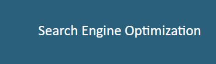
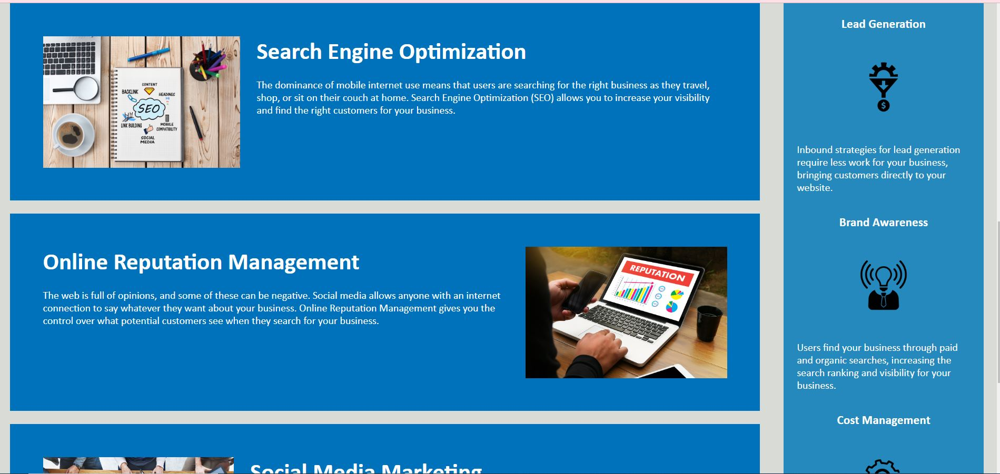

# [Accessibility-Refactor-Horiizon](https://imogenc0.github.io/accessibility-refactor-horiseon/)

Refactoring the Horiseon site to make it more accessible to users

## Description

This project refactors the Horiseon landing page to make it more accessible by cleaning up the HTML and CSS Stylesheet to make it easier for potential future developers to navigate and to make the site more accessible for people who use screen readers and other accessilbility features.

## Installation

N/A

## Usage

Clicking on this Search Engine Optimisation tab (as shown above) leads to this section on the page:

Clicking on this Online Reputation Management tab (as shown above) leads to this section on the page:

Clicking on this Social Media Management tab (as shown above) leads to this section on the page:

## Credits

N/A

## Liscence

MIT Liscence - please see liscence for reference.
